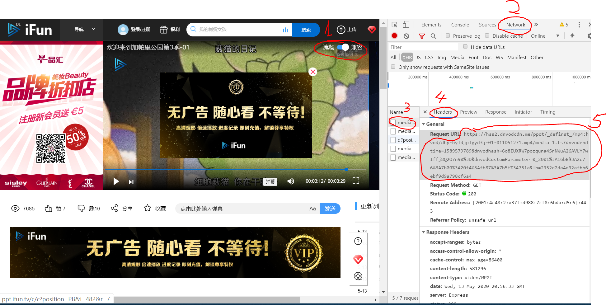
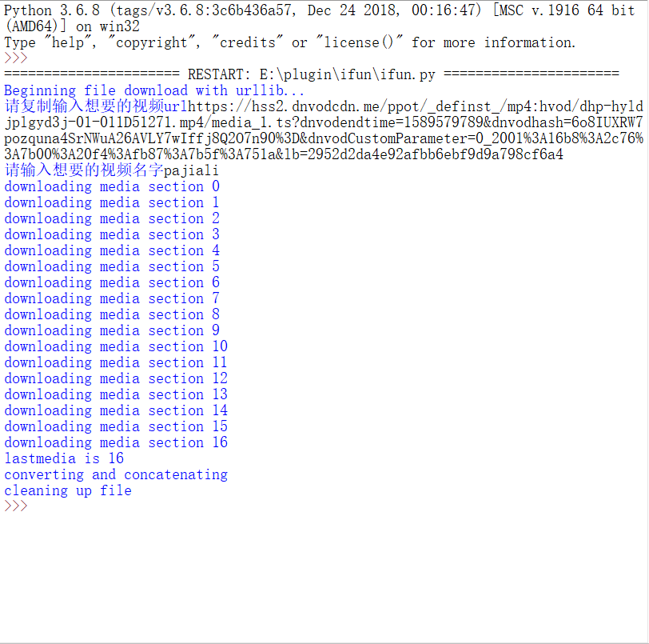

# 重要提示：
所有文件都有版权，请在下载后24小时内删除，仅供学习参考，不可作为商业用途。

文件下载后，所有带来的版权问题由下载者自己承担，本程序不承担任何相关责任。

# V1

## Prerequists 要事先安装的包：
1. ffmpeg
https://www.ffmpeg.org/download.html
2. python-ffmpeg
https://github.com/kkroening/ffmpeg-python

## 使用说明

1. 选择ifun里面的兼容模式
2. 打开各个浏览器的开发者界面devtools
3. 选择network
4. 选择一个以media 开头的文件
5. 右边选择headers
6. 拷贝下面的url备用


##
7. 依次输入url和想要的名字
8. 在out1目录下就有了想要的视频
##


## 由于是分段下载，大视频可能下载比较慢

# V2 04.04.2021
## 特性
使用selenium和chrome-driver实现了内部URL的查找
所以V1中的手动抄内部URL就废弃了，只要输入网页上的URL就可以。
和新版的ifsp一帆视频也兼容（貌似只改了UI，没改后端）
```
比如：https://www.ifsp.tv/play?id=7YxJxydgFH1（斗破苍穹）
```

## selenium下载
```
pip3 install selenium
```

## chrome-driver下载
https://sites.google.com/a/chromium.org/chromedriver/downloads
### 注意
查看chrome的版本：右上角点击三个点->关于chrome，安装版本和本机下载对应driver，然后解压成.exe放在c://windows/下，或者/usr/local/bin/下面

